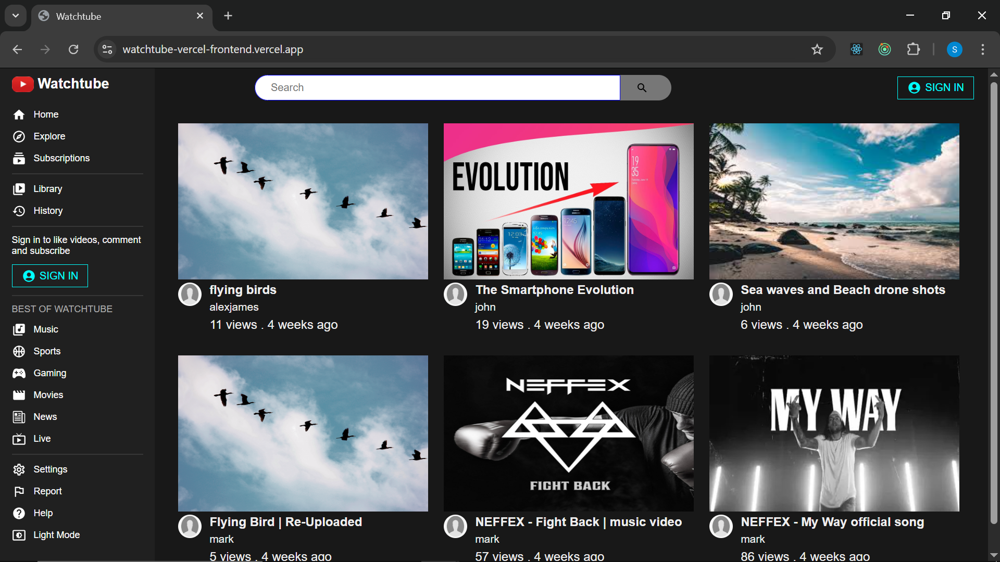
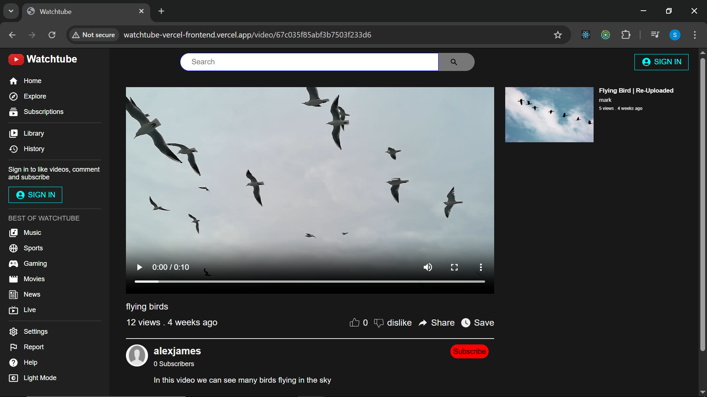
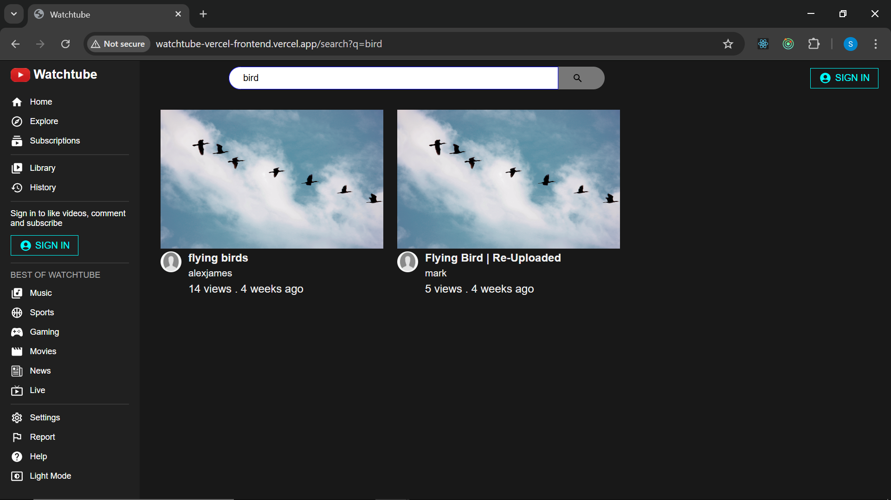
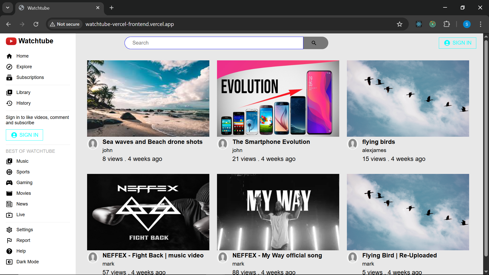
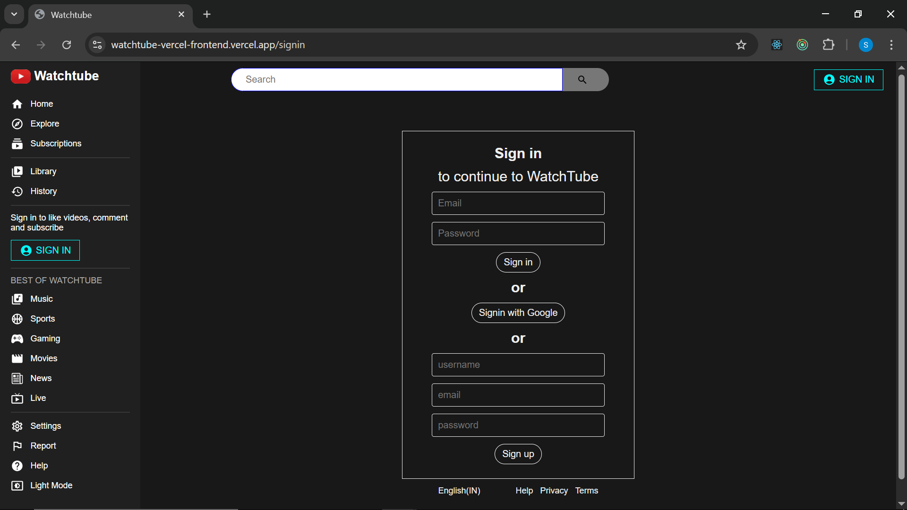

# Video Sharing Platform - (Watchtube)

## Overview  
This is a full-stack video-sharing platform built with the MERN stack (MongoDB, Express.js, React.js, Node.js). It allows users to upload, watch, like, dislike, comment, search, subscribe, unsubscribe and get subscribed videos.  

## Live website
🔗 [Deployed on Vercel](https://watchtube-vercel-frontend.vercel.app/)  

## Features  
- [x] User authentication (JWT-based & Google OAuth)  
- [x] Video upload & streaming (Stored on Cloudinary)  
- [x] Like, dislike, comment on videos  
- [x] Subscribe and Unsubscribe channels 
- [x] Search videos by title  
- [x] View subscribed videos  
- [x] Dark/Light mode  

## Tech Stack  
- **Frontend:** React.js, Redux Toolkit 
- **Backend:** Node.js, Express.js, MongoDB  
- **Storage:** Cloudinary (for video storage)  
- **Authentication:** JWT (JSON Web Tokens) & Google OAuth  

## Screenshots  
### Home Page  
  

### Video Page  
  

### Search Feature  
  

### Light Mode  
  

### Authentication (Login/Signup)
